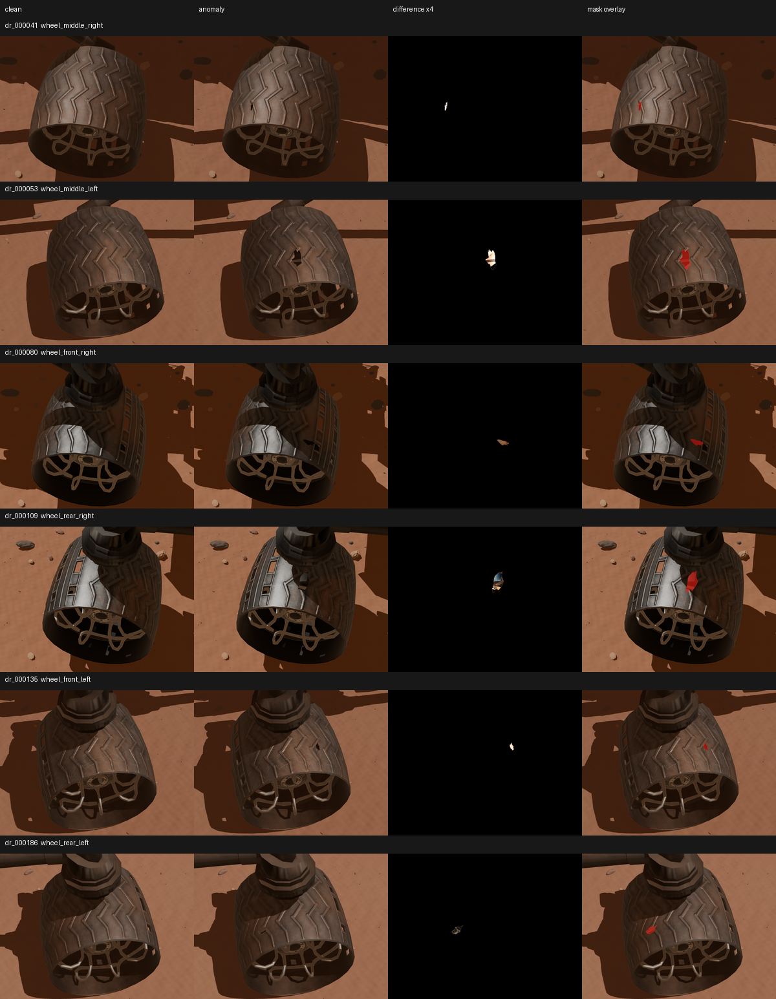

# Curiosity Wheel Anomaly Detection

Synthetic data generation and visual anomaly detection for Curiosity rover
wheels. The project combines a reproducible Blender pipeline with four anomaly
detection approaches evaluated at image and pixel level.



## Overview

The original NASA rover asset is converted into a controlled Martian scene.
Camera pose, wheel rotation, terrain, lighting and surface wear are varied to
produce clean images and paired images containing a synthetic wheel
perforation. Models are trained only on clean samples and evaluated on both
anomaly classification and localization.

```text
NASA Curiosity GLB
        |
        v
Blender scene and domain randomization
        |
        v
Paired RGB images and semantic masks
        |
        v
Clean-only training -> anomaly score and anomaly map
        |
        v
Image-level and pixel-level evaluation
```

## Dataset

The final dataset contains:

| Content | Count |
| --- | ---: |
| RGB images | 10,000 |
| Target-wheel masks | 10,000 |
| Hole-anomaly masks | 1,250 |
| Training images, clean only | 7,000 |
| Validation images | 1,000 |
| Test images | 2,000 |

Clean and anomalous evaluation samples are paired so that the scene remains
fixed while only the wheel damage changes. The dataset is generated locally
under `outputs/anomaly_detection_2/` and is intentionally excluded from Git.
Its composition and validation contract are described in the
[dataset generation index](docs/generation/INDEX.md).

## Models and selected results

The repository includes PatchCore, EfficientAD-S, TinyGLASS and
SuperSimpleNet. The table reports representative test results already recorded
in the experiment history.

| Model | Image AUROC | Image AP | Pixel AUROC | Pixel AP |
| --- | ---: | ---: | ---: | ---: |
| PatchCore Reference, bank 50k | 0.77942 | 0.79660 | 0.98500 | **0.30947** |
| EfficientAD-S, pose A, global max | 0.66502 | 0.64737 | 0.96365 | 0.09004 |
| TinyGLASS, pose A, 512 px, layer3 | 0.77330 | 0.81126 | 0.97924 | 0.27592 |
| SuperSimpleNet, pose A, Perlin 0.2 | **0.83133** | **0.86214** | 0.97317 | 0.16779 |

These rows summarize different experimental scopes and are not intended as a
strict leaderboard. Pose selection, crop, input resolution and model-selection
protocol are documented in
[the complete experiment history](docs/anomaly_detection/experiment_history.md).

## Installation

Run commands from `wheel_anomaly_detection/`. Keep the host ML environment
separate from Blender's bundled Python.

```bash
python -m pip install -r requirements/anomaly_detection.txt
```

Dataset-generation utilities have a smaller dependency set:

```bash
python -m pip install -r requirements/generation.txt
```

Reproducible rendering targets Blender 5.2.0 LTS, Eevee and an 800 x 600
output. The original `24584_Curiosity_static.glb` must be placed locally in
`assets/original/`; it is never committed or modified.

## Quick start

Inspect the dataset and dataloaders:

```bash
python scripts/anomaly_detection/inspect_dataloaders.py \
  dataset.root=/path/to/curiosity_wheel_hole_v1_10000
```

Run the default PatchCore experiment:

```bash
python scripts/anomaly_detection/run_experiment.py \
  dataset.root=/path/to/curiosity_wheel_hole_v1_10000
```

Select another model or an experiment preset through Hydra:

```bash
python scripts/anomaly_detection/run_experiment.py \
  dataset.root=/path/to/curiosity_wheel_hole_v1_10000 \
  model=tinyglass +experiment=tinyglass_pose_a
```

For Kaggle, use the self-contained notebook described in
[`notebooks/anomaly_detection`](notebooks/anomaly_detection/README.md).

## Repository layout

```text
assets/original/             Local immutable source asset
configs/anomaly_detection/   ML and experiment presets
configs/blender/             Dataset-generation contracts
docs/anomaly_detection/      Evaluation protocol and experiment results
docs/generation/             Dataset provenance and generation milestones
notebooks/anomaly_detection/ Self-contained Kaggle workflow
scripts/anomaly_detection/   ML entry points
scripts/blender/             Blender-side entry points
scripts/host/                Host orchestration and validation
src/anomaly_detection/       Models, data loading, training and evaluation
src/                         Testable generation logic
tests/                       Unit and validation tests
```

## Documentation

- [Anomaly-detection guide](docs/anomaly_detection/README.md)
- [Dataset and preprocessing](docs/anomaly_detection/dataloader.md)
- [Evaluation protocol](docs/anomaly_detection/evaluation.md)
- [Complete experiment history](docs/anomaly_detection/experiment_history.md)
- [Generation pipeline index](docs/generation/INDEX.md)
- [Final dataset assembly](docs/generation/final_dataset_assembly.md)

## Verification

Run the Python test suite with:

```bash
python -m pytest -q
```

Changes to the Blender pipeline additionally require the real-asset validator
and the visual checks specified by the relevant generation milestone. JSON
reports do not replace visual quality assurance.

## Limitations

- Training and evaluation currently use synthetic imagery.
- The released dataset focuses on perforation anomalies.
- Some model experiments use a single camera pose and are not directly
  comparable with all-pose experiments.
- Deployment on real rover imagery remains outside the current validation
  scope.

## Asset policy

Original 3D and geospatial assets, generated datasets, checkpoints and logs
remain local. The repository stores only the code, configuration and
documentation required to reproduce and audit the workflow.
